# DexYCB Toolkit

DexYCB Toolkit is a Python package that provides evaluation and visualization tools for the DexYCB dataset. The dataset and results were initially described in a CVPR 2021 paper:

**DexYCB: A Benchmark for Capturing Hand Grasping of Objects**  
Yu-Wei Chao, Wei Yang, Yu Xiang, Pavlo Molchanov, Ankur Handa, Jonathan Tremblay, Yashraj S. Narang, Karl Van Wyk, Umar Iqbal, Stan Birchfield, Jan Kautz, Dieter Fox  
IEEE/CVF Conference on Computer Vision and Pattern Recognition (CVPR), 2021  
[ [paper](https://dex-ycb.github.io/assets/chao_cvpr2021.pdf) ] [ [supplementary](https://dex-ycb.github.io/assets/chao_cvpr2021_supp.pdf) ] [ [video](https://youtu.be/Q4wyBaZeBw0) ] [ [arXiv](https://arxiv.org/abs/2104.04631) ] [ [project site](https://dex-ycb.github.io) ]

### Citing DexYCB Toolkit

Please cite DexYCB Toolkit if it helps your research:

    @INPROCEEDINGS{chao:cvpr2021,
      author    = {Yu-Wei Chao and Wei Yang and Yu Xiang and Pavlo Molchanov and Ankur Handa and Jonathan Tremblay and Yashraj S. Narang and Karl {Van Wyk} and Umar Iqbal and Stan Birchfield and Jan Kautz and Dieter Fox},
      booktitle = {IEEE/CVF Conference on Computer Vision and Pattern Recognition (CVPR)},
      title     = {{DexYCB}: A Benchmark for Capturing Hand Grasping of Objects},
      year      = {2021},
    }

### License

DexYCB Toolkit is released under the [GNU General Public License v3.0](LICENSE).

### Contents

1. [Prerequisites](#prerequisites)
2. [Installation](#installation)
3. [Loading Dataset and Visualizing Samples](#loading-dataset-and-visualizing-samples)
4. [Evaluation](#evaluation)
    1. [COCO Evaluation](#coco-evaluation)
    2. [BOP Evaluation](#bop-evaluation)
    3. [HPE Evaluation](#hpe-evaluation)
    4. [Grasp Evaluation](#grasp-evaluation)
5. [Reproducing CVPR 2021 Results](#reproducing-cvpr-2021-results)
6. [Visualizing Sequences](#visualizing-sequences)
    1. [Interactive 3D viewer](#interactive-3d-viewer)
    2. [Offline Renderer](#offline-renderer)

## Prerequisites

This code is tested with Python 3.7 on Linux.

## Installation

For good practice for Python package management, it is recommended to use virtual environments (e.g., `virtualenv` or `conda`) to ensure packages from different projects do not interfere with each other.

1. Clone the repo with `--recursive` and and cd into it:

    ```Shell
    git clone --recursive git@github.com:NVlabs/dex-ycb-toolkit.git
    cd dex-ycb-toolkit
    ```

2. Install the dex-ycb-toolkit package and dependencies:

    ```Shell
    # Install dex-ycb-toolkit
    pip install -e .

    # Install bop_toolkit dependencies
    cd bop_toolkit
    pip install -r requirements.txt
    cd ..

    # Install manopth
    cd manopth
    pip install -e .
    cd ..
    ```

3. Download the DexYCB dataset from the [project site](https://dex-ycb.github.io).

4. Set the environment variable for dataset path:

    ```Shell
    export DEX_YCB_DIR=/path/to/dex-ycb
    ```

    `$DEX_YCB_DIR` should be a folder with the following structure:

    ```Shell
    ├── 20200709-subject-01/
    ├── 20200813-subject-02/
    ├── ...
    ├── calibration/
    └── models/
    ```

5. Download MANO models and code (`mano_v1_2.zip`) from the [MANO website](https://mano.is.tue.mpg.de) and place the file under `manopath`. Unzip the file and create symlink:

    ```Shell
    cd manopth
    unzip mano_v1_2.zip
    cd mano
    ln -s ../mano_v1_2/models models
    cd ../..
    ```

## Loading Dataset and Visualizing Samples

1.  The example below shows how to create a DexYCB dataset given setup (e.g., `s0`) and split name (e.g., `train`). Once created, you can use the dataset to fetch image samples.

    ```Shell
    python examples/create_dataset.py
    ```

    <details>
    <summary>You should see the following output (click to expand):</summary>

    ```
    Dataset name: s0_train
    Dataset size: 465504
    1000th sample:
    {
        "color_file": "/datasets/dex-ycb-20201205/20200709-subject-01/20200709_141841/932122060861/color_000053.jpg",
        "depth_file": "/datasets/dex-ycb-20201205/20200709-subject-01/20200709_141841/932122060861/aligned_depth_to_color_000053.png",
        "label_file": "/datasets/dex-ycb-20201205/20200709-subject-01/20200709_141841/932122060861/labels_000053.npz",
        "intrinsics": {
            "fx": 613.0762329101562,
            "fy": 611.9989624023438,
            "ppx": 313.0279846191406,
            "ppy": 245.00865173339844
        },
        "ycb_ids": [
            1,
            11,
            12,
            20
        ],
        "ycb_grasp_ind": 0,
        "mano_side": "right",
        "mano_betas": [
            0.6993994116783142,
            -0.16909725964069366,
            -0.8955091834068298,
            -0.09764610230922699,
            0.07754238694906235,
            0.336286723613739,
            -0.05547792464494705,
            0.5248727798461914,
            -0.38668063282966614,
            -0.00133091164752841
        ]
    }
    .
    .
    .
    ```

    </details>

    Each sample includes the paths to the color and depth image, path to the label file, camera intrinsics, presented YCB objects' ID, index of the object being grasped, whether right or left hand, and the hand's MANO shape parameter.

    Each label file contains the following annotations packed in a dictionary:

    - `seg`: A unit8 numpy array of shape `[H, W]` containing the segmentation map. The label of each pixel can be `0` (background), [`1-21`](./dex_ycb_toolkit/dex_ycb.py#L35-57) (YCB object), or `255` (hand).
    - `pose_y`: A float32 numpy array of shape `[num_obj, 3, 4]` holding the 6D pose of each object. Each 6D pose is represented by `[R; t]`, where `R` is the `3x3` rotation matrix and `t` is the `3x1` translation.
    - `pose_m`: A float32 numpy array of shape `[1, 51]` holding the pose of the hand. `pose_m[:, 0:48]` stores the MANO pose coefficients in PCA representation, and `pose_m[0, 48:51]` stores the translation. If the image does not have a visible hand or the annotation does not exist, `pose_m` will be all `0`.
    - `joint_3d`: A float32 numpy array of shape `[1, 21, 3]` holding the 3D joint position of the hand in the camera coordinates. The joint order is specified [here](./dex_ycb_toolkit/dex_ycb.py#L59-81). If the image does not have a visible hand or the annotation does not exist, `joint_3d` will be all `-1`.
    - `joint_2d`: A float32 numpy array of shape `[1, 21, 2]` holding the 2D joint position of the hand in the image space. The joint order follows `joint_3d`. If the image does not have a visible hand or the annotation does not exist, `joint_2d` will be all `-1`.

2. The example below shows how to visualize ground-truth object and hand pose of one image sample.

    ```Shell
    python examples/visualize_pose.py
    ```

    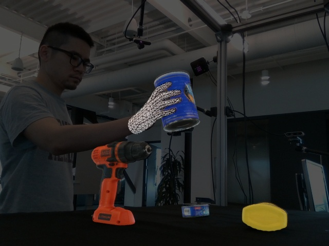
    

## Evaluation

DexYCB provides a benchmark to evaluate four tasks: (1) 2D object and keypoint detection (COCO), (2) 6D object pose estimation (BOP), (3) 3D hand pose estimation (HPE), and (4) safe human-to-robot object handover (Grasp).

Below we provide instructions and examples to run these evaluations. To run the examples, you need to first download the example results.

```Sell
./results/fetch_example_results.sh
```

### COCO Evaluation

- The example below shows how to run COCO evaluation using an example result file. The output will be logged to `results/coco_eval_s0_test_example_results_coco_s0_test.log`.

    ```Shell
    python examples/evaluate_coco.py
    ```

    <details>
    <summary>You should see the following output (click to expand):</summary>

    ```
    Evaluation results for *bbox*:
    |  AP   |  AP50  |  AP75  |  APs  |  APm  |  APl  |
    |:-----:|:------:|:------:|:-----:|:-----:|:-----:|
    | 2.970 | 2.970  | 2.970  | 3.065 | 3.017 | 2.723 |
    Per-category *bbox* AP:
    | category            | AP    | category              | AP    | category            | AP    |
    |:--------------------|:------|:----------------------|:------|:--------------------|:------|
    | 002_master_chef_can | 2.970 | 003_cracker_box       | 2.970 | 004_sugar_box       | 2.970 |
    | 005_tomato_soup_can | 2.970 | 006_mustard_bottle    | 2.970 | 007_tuna_fish_can   | 2.970 |
    | 008_pudding_box     | 2.970 | 009_gelatin_box       | 2.970 | 010_potted_meat_can | 2.970 |
    | 011_banana          | 2.970 | 019_pitcher_base      | 2.970 | 021_bleach_cleanser | 2.970 |
    | 024_bowl            | 2.970 | 025_mug               | 2.970 | 035_power_drill     | 2.970 |
    | 036_wood_block      | 2.970 | 037_scissors          | 2.970 | 040_large_marker    | 2.970 |
    | 051_large_clamp     | nan   | 052_extra_large_clamp | 2.970 | 061_foam_brick      | 2.970 |
    | hand                | 2.970 |                       |       |                     |       |
    Evaluation results for *segm*:
    |  AP   |  AP50  |  AP75  |  APs  |  APm  |  APl  |
    |:-----:|:------:|:------:|:-----:|:-----:|:-----:|
    | 2.970 | 2.970  | 2.970  | 3.065 | 3.017 | 2.723 |
    Per-category *segm* AP:
    | category            | AP    | category              | AP    | category            | AP    |
    |:--------------------|:------|:----------------------|:------|:--------------------|:------|
    | 002_master_chef_can | 2.970 | 003_cracker_box       | 2.970 | 004_sugar_box       | 2.970 |
    | 005_tomato_soup_can | 2.970 | 006_mustard_bottle    | 2.970 | 007_tuna_fish_can   | 2.970 |
    | 008_pudding_box     | 2.970 | 009_gelatin_box       | 2.970 | 010_potted_meat_can | 2.970 |
    | 011_banana          | 2.970 | 019_pitcher_base      | 2.970 | 021_bleach_cleanser | 2.970 |
    | 024_bowl            | 2.970 | 025_mug               | 2.970 | 035_power_drill     | 2.970 |
    | 036_wood_block      | 2.970 | 037_scissors          | 2.970 | 040_large_marker    | 2.970 |
    | 051_large_clamp     | nan   | 052_extra_large_clamp | 2.970 | 061_foam_brick      | 2.970 |
    | hand                | 2.970 |                       |       |                     |       |
    Evaluation results for *keypoints*:
    |  AP   |  AP50  |  AP75  |  APm  |  APl  |
    |:-----:|:------:|:------:|:-----:|:-----:|
    | 2.970 | 2.970  | 2.970  | 2.970 | 2.970 |
    Per-category *keypoints* AP:
    | category            | AP    | category              | AP   | category            | AP   |
    |:--------------------|:------|:----------------------|:-----|:--------------------|:-----|
    | 002_master_chef_can | nan   | 003_cracker_box       | nan  | 004_sugar_box       | nan  |
    | 005_tomato_soup_can | nan   | 006_mustard_bottle    | nan  | 007_tuna_fish_can   | nan  |
    | 008_pudding_box     | nan   | 009_gelatin_box       | nan  | 010_potted_meat_can | nan  |
    | 011_banana          | nan   | 019_pitcher_base      | nan  | 021_bleach_cleanser | nan  |
    | 024_bowl            | nan   | 025_mug               | nan  | 035_power_drill     | nan  |
    | 036_wood_block      | nan   | 037_scissors          | nan  | 040_large_marker    | nan  |
    | 051_large_clamp     | nan   | 052_extra_large_clamp | nan  | 061_foam_brick      | nan  |
    | hand                | 2.970 |                       |      |                     |      |
    Evaluation complete.
    ```

    </details>

- **Results format**: You should store the results in a `.json` file following the [COCO results format](https://cocodataset.org/#format-results). The results should be a list of dictionary items with the following key-value pairs:

    - `image_id`: Index of an image sample.
    - `category_id`: Object category ID. The value can be `0` (background), [`1-21`](./dex_ycb_toolkit/dex_ycb.py#L35-57) (YCB object), or `22` (hand).
    - `bbox`: Bounding box in `[x, y, width, height]`. Required for the [`bbox`](./dex_ycb_toolkit/coco_eval.py#L221) task.
    - `score`: Detection score.
    - `segmentation`: Segmentation in RLE. Required for the [`segm`](./dex_ycb_toolkit/coco_eval.py#L221) task.
    - `keypoints`: Keypoints in `[x1, y1, v1, ..., x21, y21, v21]`. Required for the [`keypoints`](./dex_ycb_toolkit/coco_eval.py#L221) task.

    You can also look at the example result files in `results/example_results_coco_*.json`.

- To evaluate on your own results, simply add `--name` to specify the setup and split and `--res_file` to specify the path to the result file. For example:

    ```Shell
    python examples/evaluate_coco.py \
      --name s0_test \
      --res_file path/to/results.json
    ```

### BOP Evaluation

- The example below shows how to run BOP evaluation using an example result file. The output will be logged to `results/bop_eval_s0_test_example_results_bop_s0_test.log`.

    ```Shell
    python examples/evaluate_bop.py
    ```

    <details>
    <summary>You should see the following output (click to expand):</summary>

    ```
    Deriving results for *all*
    Evaluation results for *all*:
    |  vsd  |  mssd  |  mspd  |  mean  |
    |:-----:|:------:|:------:|:------:|
    | 0.129 | 0.123  | 0.177  | 0.143  |
    Per-object scores for *all*:
    | object                |   vsd |   mssd |   mspd |   mean |
    |:----------------------|------:|-------:|-------:|-------:|
    | 002_master_chef_can   | 0.768 |  0.768 |  0.768 |  0.768 |
    | 003_cracker_box       | 0.818 |  0.812 |  0.812 |  0.814 |
    | 004_sugar_box         | 0.000 |  0.000 |  0.000 |  0.000 |
    | 005_tomato_soup_can   | 0.000 |  0.000 |  0.000 |  0.000 |
    | 006_mustard_bottle    | 0.000 |  0.000 |  0.000 |  0.000 |
    | 007_tuna_fish_can     | 0.000 |  0.000 |  0.098 |  0.033 |
    | 008_pudding_box       | 0.113 |  0.000 |  0.098 |  0.071 |
    | 009_gelatin_box       | 0.000 |  0.000 |  0.022 |  0.007 |
    | 010_potted_meat_can   | 0.000 |  0.000 |  0.017 |  0.006 |
    | 011_banana            | 0.000 |  0.000 |  0.000 |  0.000 |
    | 019_pitcher_base      | 0.001 |  0.000 |  0.000 |  0.000 |
    | 021_bleach_cleanser   | 0.029 |  0.000 |  0.000 |  0.010 |
    | 024_bowl              | 0.000 |  0.000 |  0.015 |  0.005 |
    | 025_mug               | 0.870 |  0.870 |  0.933 |  0.891 |
    | 035_power_drill       | 0.000 |  0.000 |  0.004 |  0.001 |
    | 036_wood_block        | 0.000 |  0.000 |  0.000 |  0.000 |
    | 037_scissors          | 0.000 |  0.011 |  0.021 |  0.011 |
    | 040_large_marker      | 0.000 |  0.000 |  0.105 |  0.035 |
    | 052_extra_large_clamp | 0.000 |  0.000 |  0.205 |  0.068 |
    | 061_foam_brick        | 0.000 |  0.000 |  0.532 |  0.177 |
    Deriving results for *grasp only*
    Evaluation results for *grasp only*:
    |  vsd  |  mssd  |  mspd  |  mean  |
    |:-----:|:------:|:------:|:------:|
    | 0.160 | 0.160  | 0.268  | 0.196  |
    Per-object scores for *grasp only*:
    | object                |   vsd |   mssd |   mspd |   mean |
    |:----------------------|------:|-------:|-------:|-------:|
    | 002_master_chef_can   | 3.115 |  3.114 |  3.114 |  3.114 |
    | 003_cracker_box       | 0.024 |  0.000 |  0.000 |  0.008 |
    | 004_sugar_box         | 0.000 |  0.000 |  0.000 |  0.000 |
    | 005_tomato_soup_can   | 0.000 |  0.000 |  0.000 |  0.000 |
    | 006_mustard_bottle    | 0.000 |  0.000 |  0.000 |  0.000 |
    | 007_tuna_fish_can     | 0.000 |  0.000 |  0.028 |  0.009 |
    | 008_pudding_box       | 0.000 |  0.000 |  0.000 |  0.000 |
    | 009_gelatin_box       | 0.000 |  0.000 |  0.100 |  0.033 |
    | 010_potted_meat_can   | 0.000 |  0.000 |  0.072 |  0.024 |
    | 011_banana            | 0.000 |  0.000 |  0.000 |  0.000 |
    | 019_pitcher_base      | 0.003 |  0.000 |  0.000 |  0.001 |
    | 021_bleach_cleanser   | 0.000 |  0.000 |  0.000 |  0.000 |
    | 024_bowl              | 0.000 |  0.000 |  0.061 |  0.020 |
    | 025_mug               | 0.000 |  0.000 |  0.232 |  0.077 |
    | 035_power_drill       | 0.000 |  0.000 |  0.017 |  0.006 |
    | 036_wood_block        | 0.000 |  0.000 |  0.000 |  0.000 |
    | 037_scissors          | 0.000 |  0.044 |  0.078 |  0.041 |
    | 040_large_marker      | 0.000 |  0.000 |  0.344 |  0.115 |
    | 052_extra_large_clamp | 0.000 |  0.000 |  0.385 |  0.128 |
    | 061_foam_brick        | 0.000 |  0.000 |  0.876 |  0.292 |
    Evaluation complete.
    ```

    </details>

- **Warning:** Compared to COCO and HPE evaluation, BOP evaluation is much more compute expensive, which can take up to an hour for a full run or even more depending on the compute resource.

- **Results format**: You should store the results in a `.csv` file following the [BOP results format](https://bop.felk.cvut.cz/challenges/#formatofresults). Each line should represent one pose estimate with the following variables separated by commas:

    - `scene_id`: Scene ID. You can get this by [`get_bop_id_from_idx()`](./dex_ycb_toolkit/dex_ycb.py#L277-290).
    - `im_id`: Image ID. You get can this by [`get_bop_id_from_idx()`](./dex_ycb_toolkit/dex_ycb.py#L277-290).
    - `obj_id`: [YCB object ID](./dex_ycb_toolkit/dex_ycb.py#L35-57).
    - `score`: Confidence score.
    - `R`: A `3x3` rotation matrix in `r11 r12 r13 r21 r22 r23 r31 r32 r33`.
    - `t`: A `3x1` translation vector (in mm) in `t1 t2 t3`.
    - `time`: Set to `-1`.

    As described in the [supplementary paper Sec. C.1](https://dex-ycb.github.io/assets/chao_cvpr2021_supp.pdf), to speed up the BOP evaluation we only evaluate on a set of subsampled keyframes. As a result, you only need to generate pose estimates for these keyframes. Each image sample will contain a `is_bop_target` key to indicate whether this image is a keyframe used for BOP evaluation. The example below shows how you may use `is_bop_target`:

    ```Python
    from dex_ycb_toolkit.factory import get_dataset
    dataset = get_dataset('s0_test')
    for sample in dataset:
      if not sample['is_bop_target']:
        continue
      # Generate object pose estimates below for this image sample.
    ```

    You can also look at the example result files in `results/example_results_bop_*.csv`.

- To evaluate on your own results, simply add `--name` to specify the setup and split and `--res_file` to specify the path to the result file. For example:

    ```Shell
    python examples/evaluate_bop.py \
      --name s0_test \
      --res_file path/to/results.csv
    ```

### HPE Evaluation

- The example below shows how to run HPE evaluation using an example result file. The output will be logged to `results/hpe_eval_s0_test_example_results_hpe_s0_test.log`. This will also plot the PCK curves and save them to `results/hpe_curve_s0_test_example_results_hpe_s0_test/`.

    ```Shell
    python examples/evaluate_hpe.py
    ```

    <details>
    <summary>You should see the following output (click to expand):</summary>

    ```
    Running evaluation
    Results:
    | alignment     |   MPJPE (mm) |    AUC |
    |:--------------|-------------:|-------:|
    | absolute      |     280.4081 | 0.0019 |
    | root-relative |     104.7705 | 0.0585 |
    | procrustes    |      49.1635 | 0.1545 |
    Evaluation complete.
    ```
    </details>

- **Results format**: You should store the results in a `.txt` file. Each line should represent the predicted 3D position of the 21 hand joints of one image sample. Particularly, each line should have 64 comma-separated numbers:

    - The first number is the index of the image sample.
    - The following 63 numbers are the `[x, y, z]` values (in mm) of the 21 joints in the camera coordinates of the image. The numbers should be ordered in `x1, y1, z1, x2, y2, z2, ..., x21, y21, z21`, where the joint order is specified [here](./dex_ycb_toolkit/dex_ycb.py#L59-81).

    You can also look at the example result files in `results/example_results_hpe_*.txt`.

- To evaluate on your own results, simply add `--name` to specify the setup and split and `--res_file` to specify the path to the result file. For example:

    ```Shell
    python examples/evaluate_hpe.py \
      --name s0_test \
      --res_file path/to/results.txt
    ```

### Grasp Evaluation

- The Grasp evaluation simply takes a result file on object pose (used for BOP evaluation) and a result file on hand segmentation (used for COCO evaluation). It will generate grasps for handover based on these results and evaluate these grasps accordingly.

- The example below shows how to run Grasp evaluation using example result files. The output will be logged to `results/grasp_eval_s0_test_example_results_bop_s0_test_example_results_coco_s0_test`. This will also generate a result file `results/grasp_res_s0_test_example_results_bop_s0_test_example_results_coco_s0_test.json`, which can later be used for plotting precision-coverage curves.

    ```Shell
    python examples/evaluate_grasp.py
    ```

    <details>
    <summary>You should see the following output (click to expand):</summary>

    ```
    Running evaluation
    0001/1152     648  003_cracker_box        # gt grasps:  62
    0002/1152     722  003_cracker_box        # gt grasps:  62
    0003/1152     796  003_cracker_box        # gt grasps:  62
    0004/1152     870  003_cracker_box        # gt grasps:  62
    0005/1152     944  003_cracker_box        # gt grasps:  62
    .
    .
    .
    1148/1152   92972  061_foam_brick         # gt grasps:  60
    1149/1152   93044  061_foam_brick         # gt grasps:  60
    1150/1152   93116  061_foam_brick         # gt grasps:  60
    1151/1152   93188  061_foam_brick         # gt grasps:  60
    1152/1152   93260  061_foam_brick         # gt grasps:  60
    Results:
    |   radius (m) |   angle (deg) |   dist th (m) |   coverage |   precision |
    |-------------:|--------------:|--------------:|-----------:|------------:|
    |       0.0500 |            15 |        0.0000 |     0.0000 |      0.0000 |
    |       0.0500 |            15 |        0.0100 |     0.0000 |      0.0000 |
    |       0.0500 |            15 |        0.0200 |     0.0000 |      0.0000 |
    |       0.0500 |            15 |        0.0300 |     0.0000 |      0.0000 |
    |       0.0500 |            15 |        0.0400 |     0.0000 |      0.0000 |
    |       0.0500 |            15 |        0.0500 |     0.0000 |      0.0000 |
    |       0.0500 |            15 |        0.0600 |     0.0000 |      0.0000 |
    |       0.0500 |            15 |        0.0700 |     0.0000 |      0.0000 |
    Evaluation complete.
    ```

    </details>

- You can also run with a `--visualize` flag, which will simultaneously save visualizations of predicted grasps. The visualizations will be saved to `results/grasp_vis_s0_test_example_results_bop_s0_test_example_results_coco_s0_test/`.

    ```Shell
    python examples/evaluate_grasp.py --visualize
    ```

    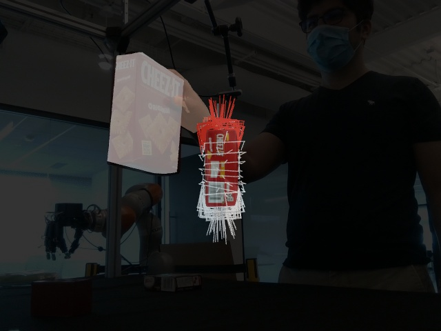
    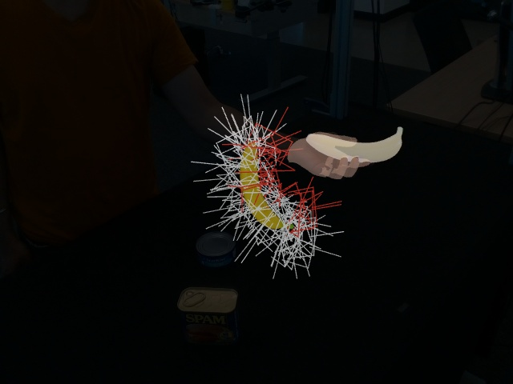

- The above command requires an active display manager. You can also run an offscreen renderer on a headless server with EGL:

    ```Shell
    PYOPENGL_PLATFORM=egl python examples/evaluate_grasp.py --visualize
    ```

- To evaluate on your own results, simply add `--name` to specify the setup and split and `--bop_res_file` and `--coco_res_file` to specify the paths to the BOP and COCO result files. For example:

    ```Shell
    python examples/evaluate_grasp.py \
      --name s0_test \
      --bop_res_file path/to/bop/results.csv \
      --coco_res_file path/to/coco/results.json
    ```

- The Grasp evaluation makes use of a set of (100) pre-generated grasps for each object. You can visualize these pre-generated grasps with:

    ```Shell
    python examples/visualize_grasps.py
    ```

    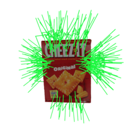
    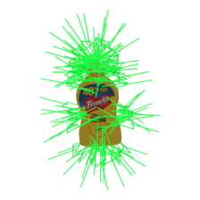
    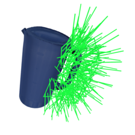
    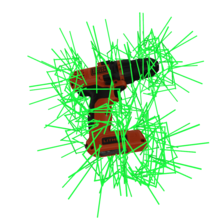

## Reproducing CVPR 2021 Results

We provide the result files of the benchmarks reported in the CVPR 2021 paper. Below we show how you can run evaluation on these files and reproduce the exact numbers in the paper.

To run the evaluation, you need to first download the CVPR 2021 results.

```Sell
./results/fetch_cvpr2021_results.sh
```

The full set of evaluation scripts can be found in [`examples/all_cvpr2021_results_eval_scripts.sh`](./examples/all_cvpr2021_results_eval_scripts.sh). Below we show some examples.

- For example, to evaluate the 2D object and keypoint detection (COCO) results of Mask R-CNN (Detectron2) on `s0`, you can run:

    ```Shell
    python examples/evaluate_coco.py \
      --name s0_test \
      --res_file results/cvpr2021_results/coco_maskrcnn_s0_test.json
    ```

    <details>
    <summary>You should see the following output (click to expand):</summary>

    ```
    Evaluation results for *bbox*:
    |   AP   |  AP50  |  AP75  |  APs   |  APm   |  APl   |
    |:------:|:------:|:------:|:------:|:------:|:------:|
    | 75.762 | 96.082 | 87.723 | 31.271 | 77.584 | 71.907 |
    Per-category *bbox* AP:
    | category            | AP     | category              | AP     | category            | AP     |
    |:--------------------|:-------|:----------------------|:-------|:--------------------|:-------|
    | 002_master_chef_can | 83.872 | 003_cracker_box       | 85.846 | 004_sugar_box       | 81.297 |
    | 005_tomato_soup_can | 76.031 | 006_mustard_bottle    | 81.557 | 007_tuna_fish_can   | 68.076 |
    | 008_pudding_box     | 73.595 | 009_gelatin_box       | 69.509 | 010_potted_meat_can | 75.634 |
    | 011_banana          | 70.533 | 019_pitcher_base      | 87.170 | 021_bleach_cleanser | 80.978 |
    | 024_bowl            | 80.615 | 025_mug               | 76.013 | 035_power_drill     | 81.826 |
    | 036_wood_block      | 83.745 | 037_scissors          | 64.070 | 040_large_marker    | 52.693 |
    | 051_large_clamp     | nan    | 052_extra_large_clamp | 73.413 | 061_foam_brick      | 72.683 |
    | hand                | 71.847 |                       |        |                     |        |
    Evaluation results for *segm*:
    |   AP   |  AP50  |  AP75  |  APs   |  APm   |  APl   |
    |:------:|:------:|:------:|:------:|:------:|:------:|
    | 69.584 | 93.835 | 78.718 | 20.954 | 70.949 | 77.700 |
    Per-category *segm* AP:
    | category            | AP     | category              | AP     | category            | AP     |
    |:--------------------|:-------|:----------------------|:-------|:--------------------|:-------|
    | 002_master_chef_can | 82.683 | 003_cracker_box       | 83.721 | 004_sugar_box       | 77.713 |
    | 005_tomato_soup_can | 74.745 | 006_mustard_bottle    | 79.395 | 007_tuna_fish_can   | 67.144 |
    | 008_pudding_box     | 70.392 | 009_gelatin_box       | 68.429 | 010_potted_meat_can | 72.659 |
    | 011_banana          | 63.432 | 019_pitcher_base      | 84.669 | 021_bleach_cleanser | 77.515 |
    | 024_bowl            | 78.120 | 025_mug               | 71.945 | 035_power_drill     | 73.797 |
    | 036_wood_block      | 81.409 | 037_scissors          | 29.361 | 040_large_marker    | 42.423 |
    | 051_large_clamp     | nan    | 052_extra_large_clamp | 54.032 | 061_foam_brick      | 72.848 |
    | hand                | 54.834 |                       |        |                     |        |
    Evaluation results for *keypoints*:
    |   AP   |  AP50  |  AP75  |  APm   |  APl   |
    |:------:|:------:|:------:|:------:|:------:|
    | 36.418 | 71.681 | 32.762 | 38.779 | 35.363 |
    Per-category *keypoints* AP:
    | category            | AP     | category              | AP   | category            | AP   |
    |:--------------------|:-------|:----------------------|:-----|:--------------------|:-----|
    | 002_master_chef_can | nan    | 003_cracker_box       | nan  | 004_sugar_box       | nan  |
    | 005_tomato_soup_can | nan    | 006_mustard_bottle    | nan  | 007_tuna_fish_can   | nan  |
    | 008_pudding_box     | nan    | 009_gelatin_box       | nan  | 010_potted_meat_can | nan  |
    | 011_banana          | nan    | 019_pitcher_base      | nan  | 021_bleach_cleanser | nan  |
    | 024_bowl            | nan    | 025_mug               | nan  | 035_power_drill     | nan  |
    | 036_wood_block      | nan    | 037_scissors          | nan  | 040_large_marker    | nan  |
    | 051_large_clamp     | nan    | 052_extra_large_clamp | nan  | 061_foam_brick      | nan  |
    | hand                | 36.418 |                       |      |                     |      |
    Evaluation complete.
    ```

    </details>

    The output will also be logged to `results/coco_eval_s0_test_coco_maskrcnn_s0_test.log`.

- For example, to evaluate the 6D object pose estimation (BOP) results of CosyPose on `s1`, you can run:

    ```Shell
    python examples/evaluate_bop.py \
      --name s1_test \
      --res_file results/cvpr2021_results/bop_cosypose_s1_test.csv
    ```

    <details>
    <summary>You should see the following output (click to expand):</summary>

    ```
    Deriving results for *all*
    Evaluation results for *all*:
    |  vsd   |  mssd  |  mspd  |  mean  |
    |:------:|:------:|:------:|:------:|
    | 50.384 | 71.791 | 74.431 | 65.535 |
    Per-object scores for *all*:
    | object                |    vsd |   mssd |   mspd |   mean |
    |:----------------------|-------:|-------:|-------:|-------:|
    | 002_master_chef_can   | 85.753 | 83.628 | 82.859 | 84.080 |
    | 003_cracker_box       | 84.040 | 92.605 | 88.905 | 88.516 |
    | 004_sugar_box         | 76.383 | 82.469 | 84.067 | 80.973 |
    | 005_tomato_soup_can   | 55.897 | 59.633 | 69.034 | 61.521 |
    | 006_mustard_bottle    | 62.274 | 77.397 | 77.298 | 72.323 |
    | 007_tuna_fish_can     | 56.964 | 61.002 | 75.030 | 64.332 |
    | 008_pudding_box       | 60.449 | 77.836 | 84.344 | 74.209 |
    | 009_gelatin_box       | 56.673 | 72.329 | 82.828 | 70.610 |
    | 010_potted_meat_can   | 55.996 | 76.488 | 83.338 | 71.941 |
    | 011_banana            |  6.616 | 63.311 | 64.266 | 44.731 |
    | 019_pitcher_base      | 43.229 | 73.489 | 59.781 | 58.833 |
    | 021_bleach_cleanser   | 61.659 | 75.832 | 69.177 | 68.889 |
    | 024_bowl              | 72.657 | 87.537 | 91.571 | 83.922 |
    | 025_mug               | 44.858 | 64.239 | 70.424 | 59.841 |
    | 035_power_drill       | 19.341 | 75.055 | 68.193 | 54.196 |
    | 036_wood_block        | 60.846 | 80.535 | 73.649 | 71.677 |
    | 037_scissors          |  1.481 | 47.346 | 44.762 | 31.196 |
    | 040_large_marker      | 42.481 | 70.218 | 86.952 | 66.550 |
    | 052_extra_large_clamp | 24.680 | 77.485 | 78.131 | 60.099 |
    | 061_foam_brick        | 32.808 | 30.573 | 47.635 | 37.006 |
    Deriving results for *grasp only*
    Evaluation results for *grasp only*:
    |  vsd   |  mssd  |  mspd  |  mean  |
    |:------:|:------:|:------:|:------:|
    | 43.372 | 63.000 | 65.931 | 57.434 |
    Per-object scores for *grasp only*:
    | object                |    vsd |   mssd |   mspd |   mean |
    |:----------------------|-------:|-------:|-------:|-------:|
    | 002_master_chef_can   | 79.613 | 76.590 | 75.433 | 77.212 |
    | 003_cracker_box       | 82.660 | 94.330 | 88.185 | 88.392 |
    | 004_sugar_box         | 69.308 | 69.196 | 70.325 | 69.609 |
    | 005_tomato_soup_can   | 44.397 | 50.901 | 62.995 | 52.764 |
    | 006_mustard_bottle    | 59.477 | 71.649 | 70.210 | 67.112 |
    | 007_tuna_fish_can     | 41.092 | 44.802 | 61.113 | 49.002 |
    | 008_pudding_box       | 55.603 | 73.812 | 81.245 | 70.220 |
    | 009_gelatin_box       | 44.160 | 58.278 | 70.443 | 57.627 |
    | 010_potted_meat_can   | 49.464 | 70.085 | 76.572 | 65.374 |
    | 011_banana            |  5.492 | 47.786 | 53.166 | 35.481 |
    | 019_pitcher_base      | 40.258 | 66.738 | 51.030 | 52.675 |
    | 021_bleach_cleanser   | 55.303 | 71.964 | 63.579 | 63.615 |
    | 024_bowl              | 61.346 | 79.147 | 83.728 | 74.740 |
    | 025_mug               | 35.344 | 51.434 | 58.652 | 48.476 |
    | 035_power_drill       | 13.889 | 70.908 | 62.873 | 49.223 |
    | 036_wood_block        | 56.199 | 77.507 | 67.724 | 67.143 |
    | 037_scissors          |  0.644 | 37.083 | 35.339 | 24.355 |
    | 040_large_marker      | 24.572 | 51.052 | 76.110 | 50.578 |
    | 052_extra_large_clamp | 18.313 | 65.989 | 68.030 | 50.777 |
    | 061_foam_brick        | 25.615 | 25.186 | 39.571 | 30.124 |
    Evaluation complete.
    ```

    </details>

    The output will also be logged to `results/bop_eval_s1_test_bop_cosypose_s1_test.log`.

- For example, to evaluate the 3D hand pose estimation (HPE) results of Spurr et al. + HRNet32 on `s2`, you can run:

    ```Shell
    python examples/evaluate_hpe.py \
      --name s2_test \
      --res_file results/cvpr2021_results/hpe_spurr_hrnet_s2_test.txt
    ```

    <details>
    <summary>You should see the following output (click to expand):</summary>

    ```
    Running evaluation
    Results:
    | alignment     |   MPJPE (mm) |    AUC |
    |:--------------|-------------:|-------:|
    | absolute      |      80.6272 | 0.2173 |
    | root-relative |      25.4875 | 0.5299 |
    | procrustes    |       8.2075 | 0.8359 |
    Evaluation complete.
    ```

    </details>

    The output will also be logged to `results/hpe_eval_s2_test_hpe_spurr_hrnet_s2_test.log`.

- For example, to evaluate the object handover (Grasp) results of CosyPose (for 6D object pose) and Mask R-CNN (Detectron2) (for hand segmentation) on `s1`, you can run:

    ```Shell
    python examples/evaluate_grasp.py \
      --name s1_test \
      --bop_res_file results/cvpr2021_results/bop_cosypose_s1_test.csv \
      --coco_res_file results/cvpr2021_results/coco_maskrcnn_s1_test.json
    ```

    <details>
    <summary>You should see the following output (click to expand):</summary>

    ```
    Running evaluation
    0001/1440    2980  003_cracker_box        # gt grasps:  73
    0002/1440    3050  003_cracker_box        # gt grasps:  73
    0003/1440    3120  003_cracker_box        # gt grasps:  73
    0004/1440    3190  003_cracker_box        # gt grasps:  73
    0005/1440    3260  003_cracker_box        # gt grasps:  73
    .
    .
    .
    1436/1440  115990  061_foam_brick         # gt grasps:  45
    1437/1440  116064  061_foam_brick         # gt grasps:  45
    1438/1440  116138  061_foam_brick         # gt grasps:  45
    1439/1440  116212  061_foam_brick         # gt grasps:  45
    1440/1440  116286  061_foam_brick         # gt grasps:  45
    Results:
    |   radius (m) |   angle (deg) |   dist th (m) |   coverage |   precision |
    |-------------:|--------------:|--------------:|-----------:|------------:|
    |       0.0500 |            15 |        0.0000 |     0.4110 |      0.2507 |
    |       0.0500 |            15 |        0.0100 |     0.3838 |      0.3556 |
    |       0.0500 |            15 |        0.0200 |     0.3408 |      0.3826 |
    |       0.0500 |            15 |        0.0300 |     0.2906 |      0.4027 |
    |       0.0500 |            15 |        0.0400 |     0.2412 |      0.4149 |
    |       0.0500 |            15 |        0.0500 |     0.1920 |      0.4125 |
    |       0.0500 |            15 |        0.0600 |     0.1476 |      0.3695 |
    |       0.0500 |            15 |        0.0700 |     0.1133 |      0.3117 |
    Evaluation complete.
    ```

    </details>

    The output will also be logged to `results/grasp_eval_s1_test_bop_cosypose_s1_test_coco_maskrcnn_s1_test.log`.

Finally, you can reproduce the grasp precision-coverage curves for object handover on `s1` with:

```Shell
python examples/plot_grasp_curve.py
```

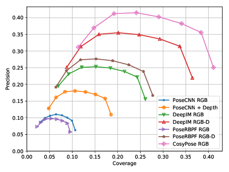

This will save the precision-coverage curves on `s1` to `results/grasp_precision_coverage_s1_test.pdf`.

The precision-coverage curves on setup `s0`, `s2`, and `s3` can be generated with:

```Shell
python examples/plot_grasp_curve.py --name s0_test
python examples/plot_grasp_curve.py --name s2_test
python examples/plot_grasp_curve.py --name s3_test
```

## Visualizing Sequences

Besides visualizing the ground truths of one image sample, we also provide tools to visualize the captured hand and object motion of a full sequence. The tools include (1) an interactive 3D viewer and (2) an offline renderer.

### Interactive 3D Viewer

- The example below shows how to run the interactive 3D viewer given a sequence name. By default it will first preload and preprocess the data of the entire sequence to provide a high frame rate rendering afterward. The preprocessing by default uses GPU. If you do not have a GPU, you need to add a `--device cpu` flag to run the preprocessing on CPU.

    ```Shell
    # Run on GPU
    python examples/view_sequence.py --name 20200709-subject-01/20200709_141754
    # Run on CPU
    python examples/view_sequence.py --name 20200709-subject-01/20200709_141754 --device cpu
    ```

    The 3D viewer provides some basic controls using mouse and keyboard. You can find the control instructions [here](./dex_ycb_toolkit/window.py#L10-27).

    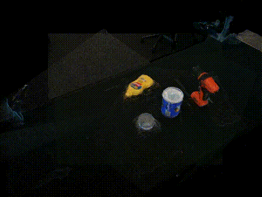
    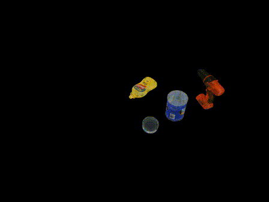

- **Warning:** The above command may consume significant CPU memory (e.g. >8G) due to the preload. You can also load frames online without preloading using a `--no-preload` flag, at the sacrifice of the rendering frame rate:

    ```Shell
    python examples/view_sequence.py --name 20200709-subject-01/20200709_141754 --no-preload
    ```

- You can list the names of all the provided sequences (1,000 in total) with:

    ```Shell
    for x in $DEX_YCB_DIR/2020*-*/; do for y in ${x}2020*_*/; do echo $(basename $x)/$(basename $y); done; done
    ```

    <details>
    <summary>You should see the following output (click to expand):</summary>

    ```
    20200709-subject-01/20200709_141754
    20200709-subject-01/20200709_141841
    20200709-subject-01/20200709_141931
    20200709-subject-01/20200709_142022
    20200709-subject-01/20200709_142123
    .
    .
    .
    20201022-subject-10/20201022_114741
    20201022-subject-10/20201022_114802
    20201022-subject-10/20201022_114824
    20201022-subject-10/20201022_114847
    20201022-subject-10/20201022_114909
    ```

    </details>

### Offline Renderer

- The example below shows how to run the offline renderer given a sequence name. Similar to the 3D viewer above, you need a `--device cpu` flag to run the preprocessing on CPU.

    ```Shell
    # Run on GPU
    python examples/render_sequence.py --name 20200709-subject-01/20200709_141754
    # Run on CPU
    python examples/render_sequence.py --name 20200709-subject-01/20200709_141754 --device cpu
    ```

    This will render the color image, segmentation map, and a visualization of the hand joint position for all the frames in the sequence. The rendered images will be saved to `data/render/`.

    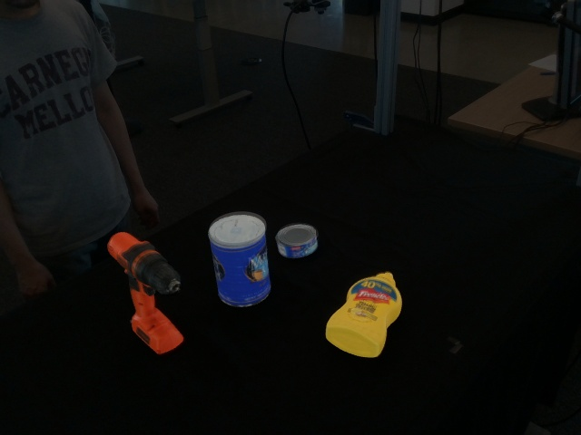
    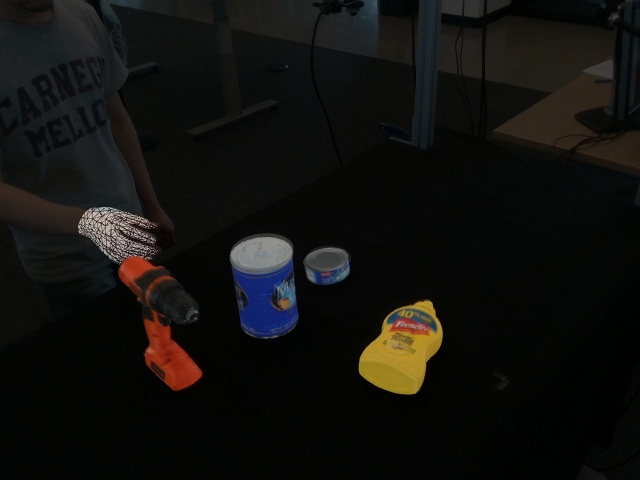
    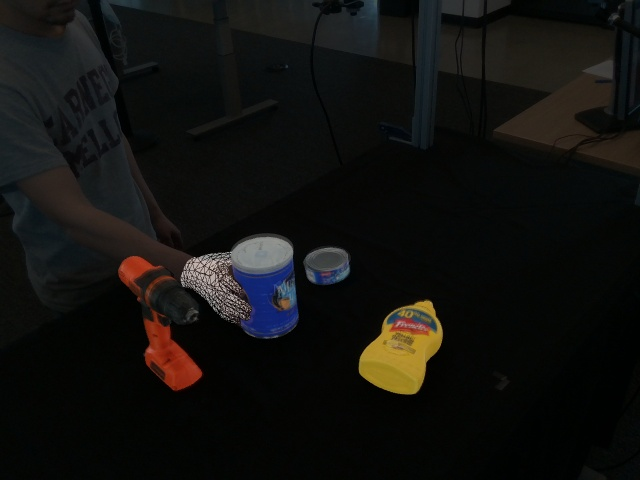
    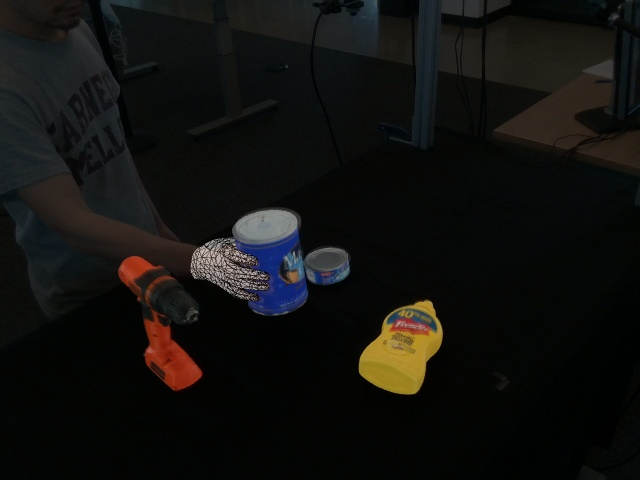
    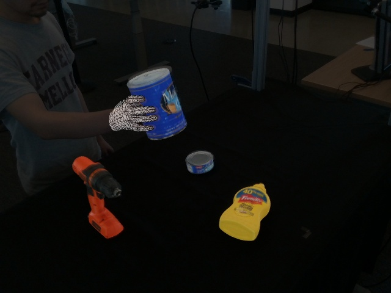
    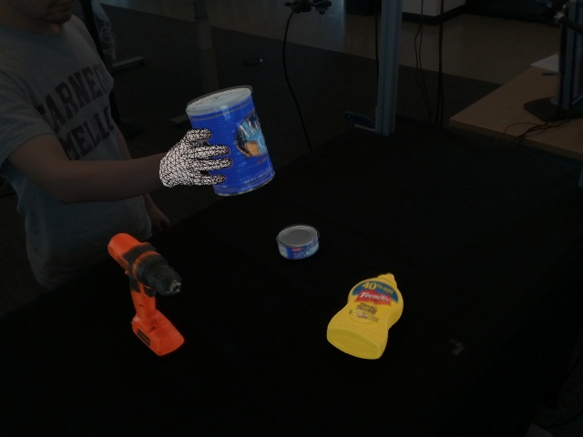
    <br>

    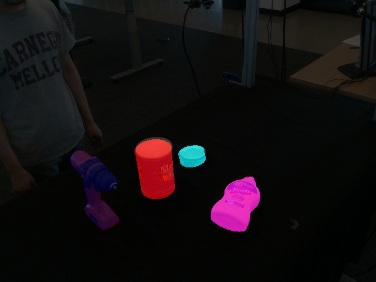
    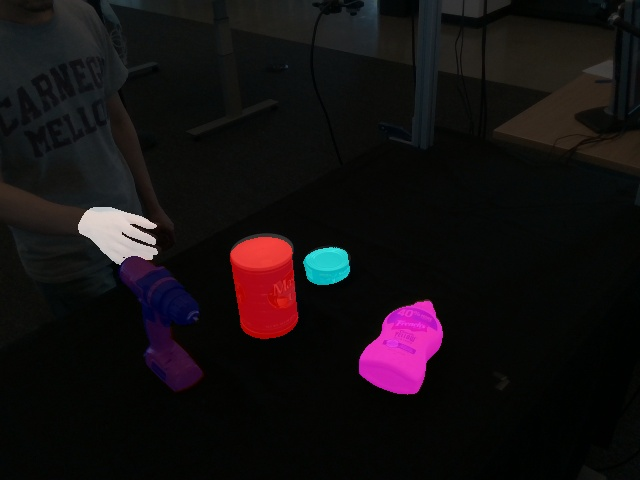
    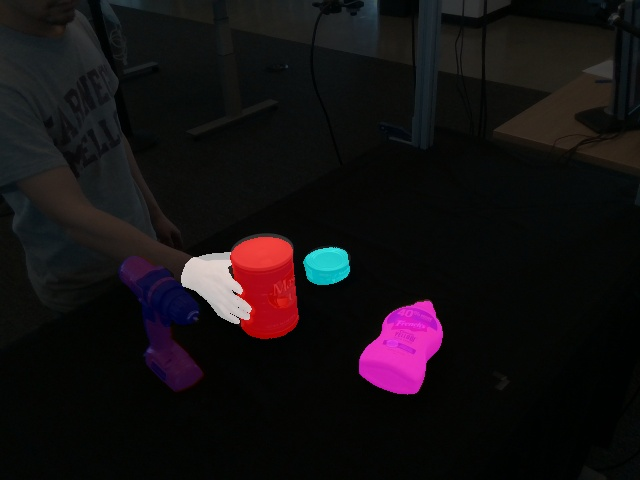
    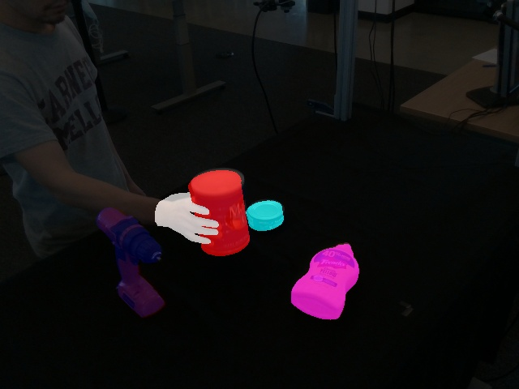
    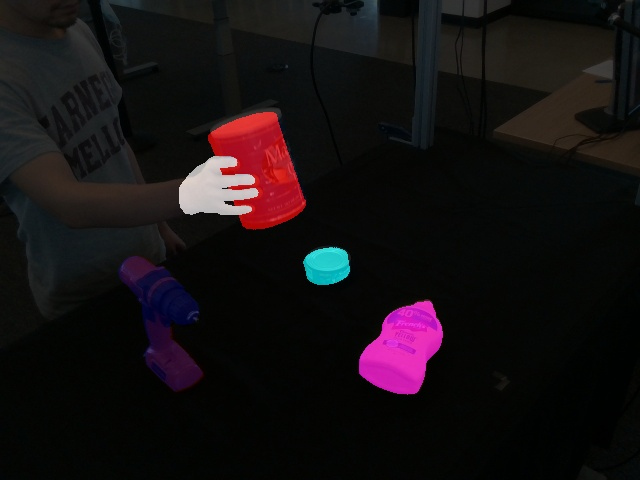
    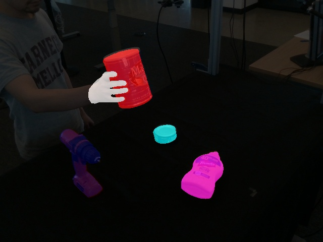
    <br>

    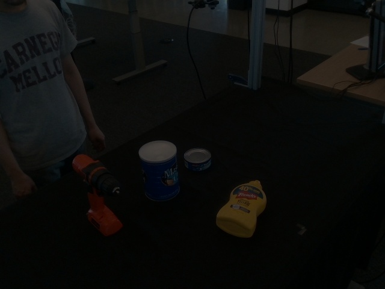
    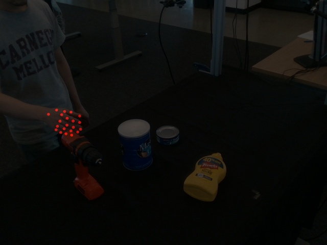
    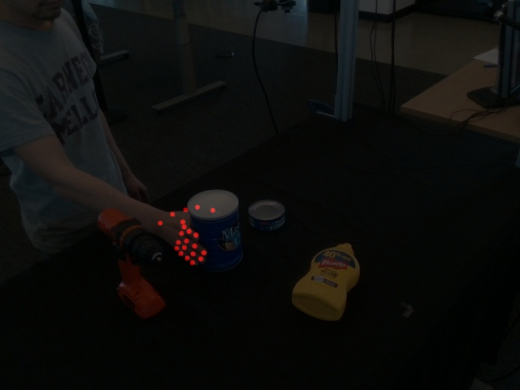
    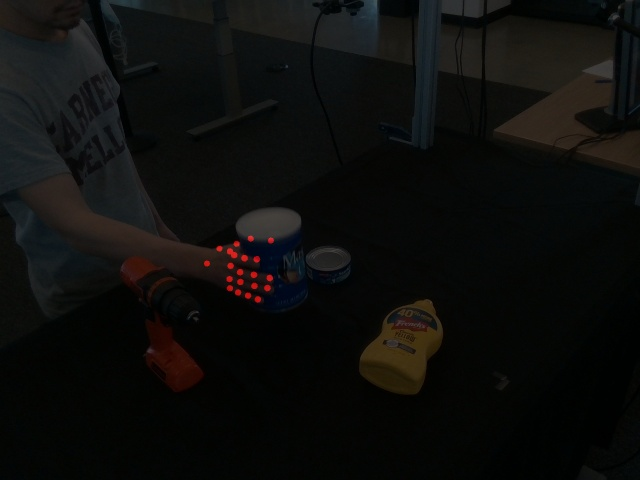
    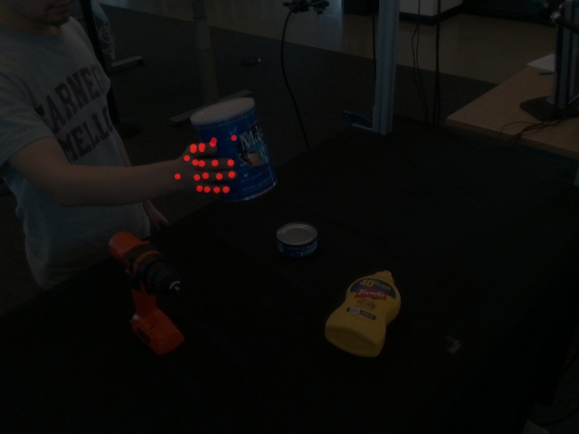
    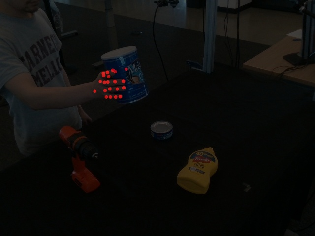

- Similar to the Grasp evaluation, if you do not have an active display manager, you can run an offscreen renderer on a headless server with EGL:

    ```Shell
    PYOPENGL_PLATFORM=egl python examples/render_sequence.py --name 20200709-subject-01/20200709_141754
    ```
